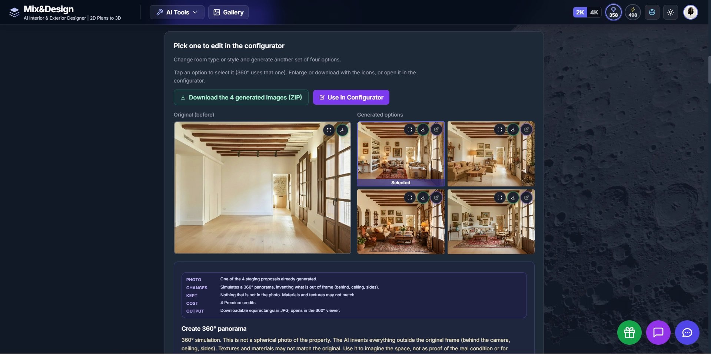
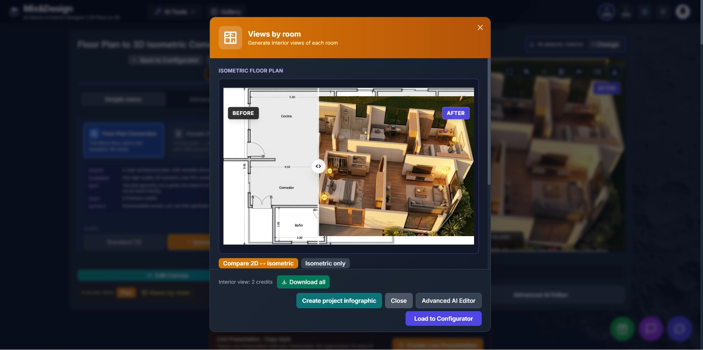
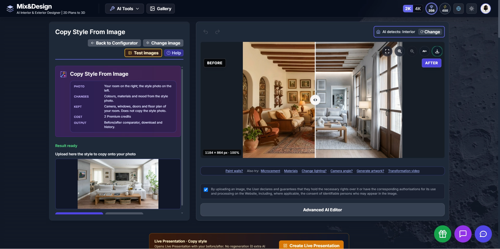
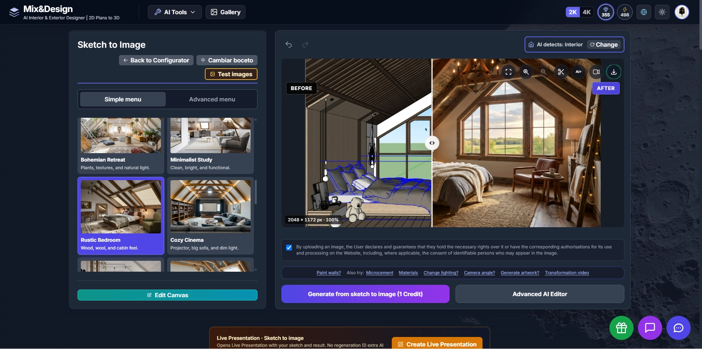

# Mix-Design AI — Visual Gallery

Explore real workflows and visual examples from Mix-Design AI.

These screenshots show the platform in action, including the interface, Before / After comparisons and different stages of the creative workflow.

---

## Virtual Staging

Generate multiple furnishing proposals from an empty space and continue the selected result in the configurator.

[View Virtual Staging examples](images/screenshots/virtual-staging/)

---

## Floor Plan to 3D

Convert a 2D architectural floor plan into a furnished 3D isometric visualization.

[View Floor Plan to 3D examples](images/screenshots/floor-plan-to-3d/)

---

## Copy Style From Image

Transfer colours, materials and atmosphere from a reference image while keeping the original room layout and key architectural elements.

[View Copy Style examples](images/screenshots/copy-style/)

---

## Sketch to Image

Transform a sketch or 3D concept into a photorealistic visualization.

[View Sketch to Image examples](images/screenshots/sketch-to-image/)

---

## Materials & Finishes

### Microcement

Apply a continuous microcement finish to floors or walls while maintaining the overall composition of the original space.

[View Microcement example](images/screenshots/materials/microcement/)

---

More Mix-Design AI workflows and visual examples will be added as the platform evolves.
