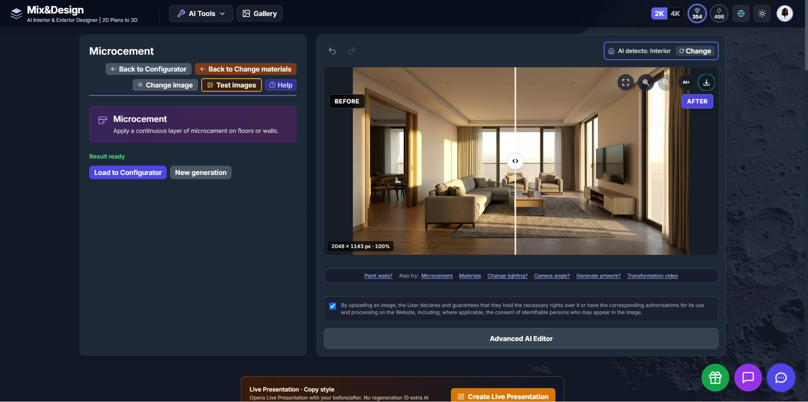

# Microcement

Visual example of the Microcement workflow in Mix-Design AI.

## Apply microcement to an existing space

Apply a continuous microcement finish to floors or walls while maintaining the overall composition of the original space.

